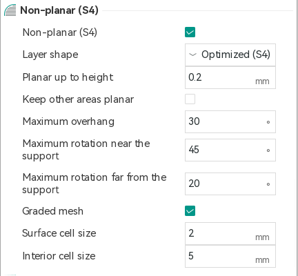
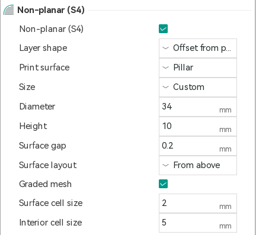
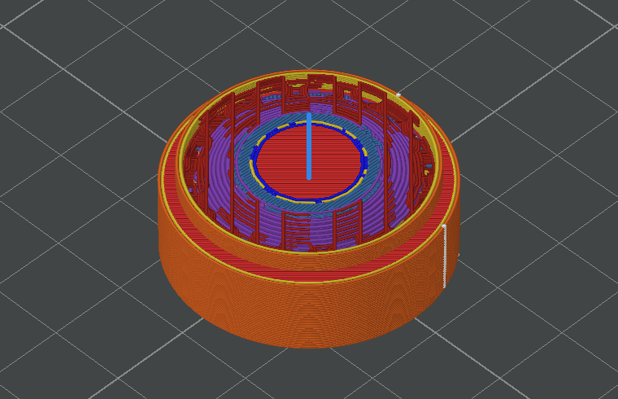
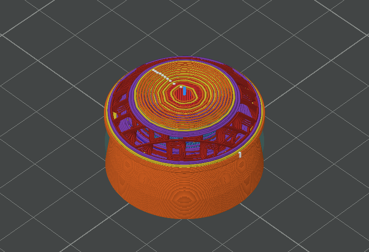
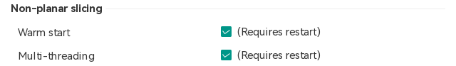
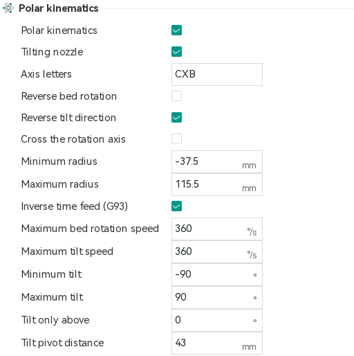
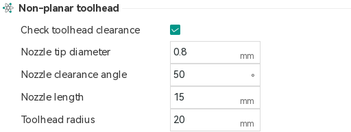
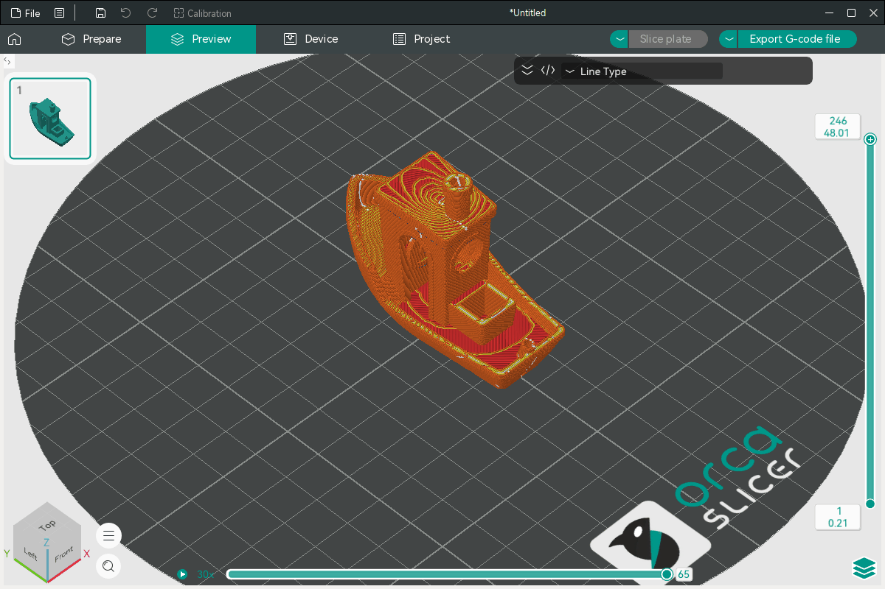
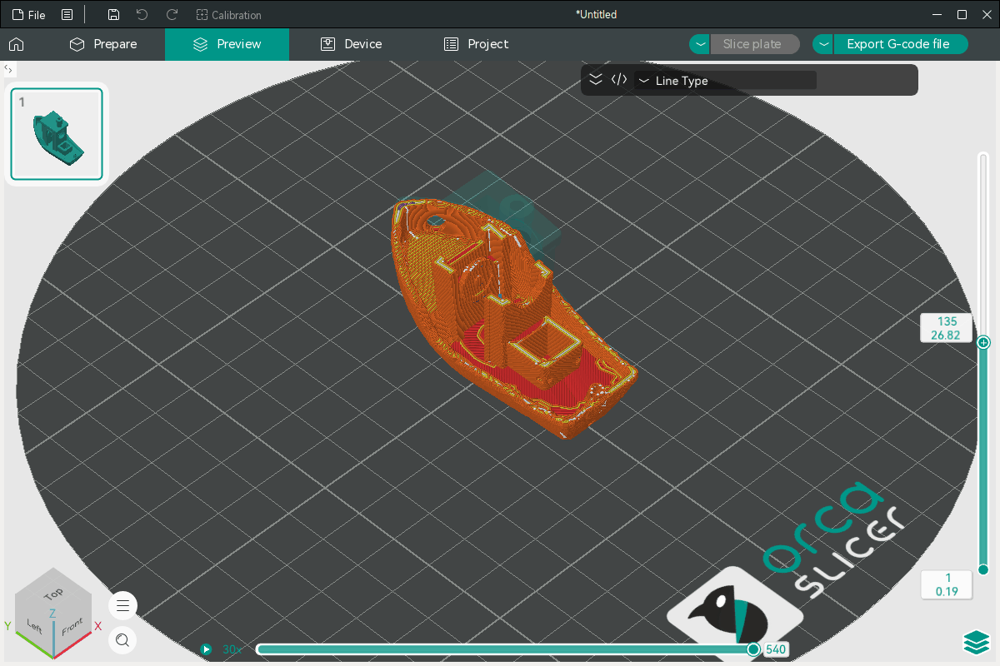
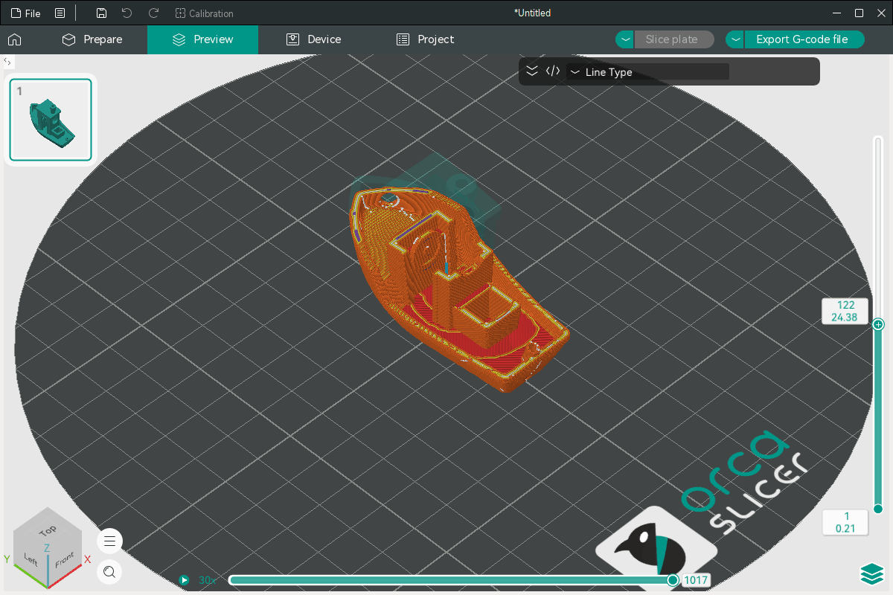

# OrcaNP

OrcaNP is a fork of [OrcaSlicer](https://github.com/OrcaSlicer/OrcaSlicer) that adds non-planar
printing. It can:

- bend the layers of a part so that overhangs print without support (S4);
- print a part in layers that follow a surface under it: a dome, a sphere, a cylinder, a pillar,
  or another part of the model;
- drive polar printers, which turn the bed under a nozzle that moves along one radius and can
  tilt, such as the Core R-Theta.

With the non-planar setting off, a printer slices exactly as it does in OrcaSlicer. The S4 method
is Joshua Bird's [S4 Slicer](https://github.com/jyjblrd/S4_Slicer), reimplemented in C++ inside the
slicing pipeline.

Test builds for Windows are on the [Releases](../../releases) page. These features are new: look at
the preview and read the warnings before you print.

The original OrcaSlicer README is in [README-OrcaSlicer.md](README-OrcaSlicer.md).

## Contents

- [Getting started](#getting-started)
- [Non-planar layers (S4)](#non-planar-layers-s4)
- [Layer shapes](#layer-shapes)
- [Print surfaces](#print-surfaces)
- [The tetrahedral mesh](#the-tetrahedral-mesh)
- [Preferences](#preferences)
- [Printers](#printers)
- [Preview](#preview)
- [Quality and speed](#quality-and-speed)
- [Building and tests](#building-and-tests)
- [Credits and license](#credits-and-license)

## Getting started

1. Add a printer. For a polar printer, pick **ThetaFirm Core R-Theta** (vendor: Custom). Any other
   printer works too; see [Printers](#printers) for what changes on a printer whose nozzle does not
   tilt.
2. Switch the settings view to **Advanced** (the switch at the top of the settings panel). The
   non-planar settings are hidden in Simple mode.
3. In **Process > Quality > Non-planar (S4)**, turn on **Non-planar (S4)**, or pick the process
   preset **0.20mm Non-planar S4 @ThetaFirm Core R-Theta**.
4. Set **Quality > Wall generator** to **Classic**. Arachne's variable-width walls are fine on flat
   layers but are not tuned for curved ones.
5. Slice, then check the preview and the warnings. The first slice of a large part can take a
   minute or more.

S4 needs relative extrusion (**Printer > Basic information > Advanced > Use relative E distances**,
on by default). The slicer refuses to slice without it.

## Non-planar layers (S4)



### How it works

The part is filled with small tetrahedra. Each tetrahedron near an overhang is given a rotation
that would make its overhang printable, and the rotations are smoothed so that neighbouring parts
of the model turn together. The mesh is then deformed by those rotations and sliced with ordinary
flat layers. Finally every point of the toolpath is mapped back from the deformed part into the
real one, where the flat layers become curved. The flow is corrected where layers were squashed or
stretched, and on a printer with a tilting nozzle the nozzle is turned to stay square to the layer.

### When to use it

- Overhangs that would otherwise need support: the underside of a cantilever, a boat hull, the
  bottom of a mushroom shape.
- Parts where the layer lines should follow the surface, for strength or looks.

It is not worth it for parts that print well flat: slicing takes longer, and curved layers need a
nozzle that clears the part around it.

### Settings

All in **Process > Quality > Non-planar (S4)**.

| Setting | What it is for | How to use it |
| --- | --- | --- |
| Non-planar (S4) | Turns non-planar layers on. | Off by default. To use it for some objects only, set it per object: switch the Process panel from **Global** to **Objects** and select the object. |
| Layer shape | Chooses how the layers curve: **Optimized (S4)** bends them where overhangs need it, **Offset from print surface** follows a surface under the part, **Conical** uses cones about the bed's rotation axis. | Use Optimized for overhangs. See [Layer shapes](#layer-shapes) for the other two. |
| Planar up to height | Prints the bottom of the part with flat layers and starts bending above this height. Above it the layers ease from flat into curved over one surface cell (2 mm by default). | Leave it at 0 for most parts: the first layer is always printed flat on the bed. Use a few millimetres when the part stands on a flat base you want printed normally. Overhangs below this height are not corrected. |
| Keep other areas planar | Holds the walls that do not overhang at no rotation, so the layers only curve near the overhangs. | Turn on when the bend spreads further through the part than you want. |
| Maximum overhang | The steepest overhang, measured from vertical, that is left as it is. Steeper ones are rotated. | 30° to 45°. Lower corrects more of the part. |
| Maximum rotation near the support | The largest rotation for the parts of an overhang closest to where it is held up. | 45° by default. The slicer lowers both rotation limits to what the nozzle can follow: the tilt axis travel on a printer that tilts the nozzle, otherwise the nozzle clearance angle (see [Toolhead clearance](#toolhead-clearance)). |
| Maximum rotation far from the support | The largest rotation for the parts of an overhang farthest away. The limit tapers from the near value to this one. | Lower than the near value, so long overhangs stay gentle at their tips. |

Three more settings are shown only in Developer mode (**Preferences > Developer > Developer mode**):

| Setting | What it is for | How to use it |
| --- | --- | --- |
| Rotation smoothing | How strongly neighbouring parts of the model keep similar rotations. | Raise it (20 to 50) for even, gentle curvature; lower it to follow each overhang more closely. |
| Rotation strength | Scales how far each overhang asks to turn. | 1 to 3. Raise it if overhangs are still too steep after slicing. |
| Deformation passes | Runs the deformation again on its own result. | 1 is enough for most parts; 2 for overhangs one pass does not fix. Each pass adds the full slicing time. |

### Toolpath corrections

These happen on their own and have no settings:

- **First layer:** the first layer is printed flat on the bed at its normal height, and the layers
  above it ease into the curved ones over the next couple of millimetres, each one above the last.
- **Flow:** where a layer is squashed or stretched by the bend, the extrusion is scaled so the wall
  keeps its width.
- **Travels:** a travel that would pass through printed material is lifted over it and retracted.
- **Seams and joins:** moves that cross between parts mapped differently are joined by a straight
  move through the part.
- **Support:** support is generated on the bent part, then printed in columns from the bed, or
  the part below, up to the real underside of the overhang it holds, keeping the support's top
  and bottom Z distances. Support that would stand beside the part above the overhang it
  reaches for holds nothing and is left out. Painted support and support blocker or enforcer
  parts are bent with the part, so they mark the faces they were placed on. Support of offset
  layers is not mapped this way.

## Layer shapes

### Offset from print surface

The part is printed over a surface in layers at a constant distance from it, like a shell. The
surface is printed first with flat layers, then the part over it, starting **Surface gap** above
it. Use it to print a part onto something, or to print a thin curved shell in even layers.



| Setting | What it is for | How to use it |
| --- | --- | --- |
| Print surface | What the layers follow: generated under or inside the part's faces painted as print surface, or a generated sphere, cylinder, pillar, dome or domed pillar. | See [Print surfaces](#print-surfaces). |
| Surface gap | The offset between the print surface and the part printed over it, all around. Like the gap between support and part, it lets the part come off the surface after printing. | 0.2 mm by default. Raise it (0.25 to 0.4 mm) if the part sticks to the surface; lower it (0.1 mm) for a smoother underside; 0 fuses the part to the surface. A generated pillar or dome lifts the part by the gap, and a generated sphere or cylinder, or the surface under painted faces, is kept the gap short of the part, so all of the part is printed. |
| Surface layout | How the layers over the surface are laid out for slicing. **From above** suits domes, spheres and capped cylinders; **Around the rotation axis** suits sleeves around the bed's axis. | Use From above unless the part wraps around the axis. |

### Conical

Layers are cones about the bed's rotation axis, as in radial slicing. They are flat where the part
stands on the bed, so the first layer is all on the bed.

| Setting | What it is for | How to use it |
| --- | --- | --- |
| Cone angle | The slope of the cones from horizontal. Positive: layers descend away from the axis, which prints outward overhangs. Negative: layers descend toward the axis. | 15° to 30°. Match the sign to the overhangs you need to print. |

## Print surfaces

The print surface is what **Offset from print surface** layers follow. It is printed first, with
flat layers, as support, and the part is printed over it **Surface gap** away.

| Print surface | What it is for | How to use it |
| --- | --- | --- |
| Painted faces | Printing the part on its own faces: a domed or flat underside, or the inside of a ring or bracelet. | Select the object, choose **Paint-on print surface** in the toolbar (J) and paint, or smart-fill, the faces it is printed onto. With **Surface layout** *From above*, the print surface is generated under the painted faces that face down, down to the bed. With *Around the rotation axis*, it is generated inside the painted faces that face the axis, which must go all the way round it, with a column down to the bed under them: the part is printed from its inside out, the nozzle leaning towards horizontal. **Size** *Automatic* lifts the part as high as the toolhead needs to lean under it, where its layers stand steep near the bed; *Custom* lifts it by **Height**. With infill lines at 0 degrees (Strength > Infill direction and Solid infill direction), a part printed round the axis prints its lines round it, which is quicker than across it. Projects from earlier test builds with parts set as print surface open with the faces next to those parts painted and the parts removed. |
| Generated sphere | Printing the inside of a dome or a hollow sphere on a core that fills it. | The sphere is fitted inside the part's cavity, so the first layer is the part's inner surface. |
| Generated cylinder | The same for a sleeve or a cup around the rotation axis. | The cylinder is fitted up to the roof of the cavity. |
| Pillar | Lifting the part off the bed on a column, so a tilting nozzle can lean under it without hitting the bed. | The part stands on top of the pillar, **Surface gap** above it. Over the pillar's flat top its layers are flat; beyond the rim they slope down at the **Cone angle** (20° by default), so a part much wider than the pillar prints on layers the nozzle can follow. What hangs below those layers beside the pillar is not printed, and slicing warns: raise the cone angle or widen the pillar. |
| Dome | Printing a concave underside, such as a lens, on a hemisphere. | The part's underside nests on the dome. A dome needs only a diameter; its height is half of it. |
| Domed pillar | A pillar with a hemisphere on top, for both at once. | |

For **Pillar**, **Dome** and **Domed pillar**:

| Setting | What it is for | How to use it |
| --- | --- | --- |
| Size | **Automatic**: as wide as the part's base, and a pillar as tall as the toolhead needs to lean as far as the tilt axis allows under the part. **Custom**: the diameter and height below. | Start with Automatic. |
| Diameter | Width of the pillar or dome. | Custom size only. |
| Height | Height of the pillar's straight side. A domed pillar adds half its diameter on top. | Custom size only; not shown for a dome. |

A generated print surface (sphere, cylinder, pillar, dome, domed pillar) is there to hold the part
while it prints and is removed afterwards, so it is always printed as support is: walls, the
support's base pattern and spacing inside, and its top interface pattern where it faces the part,
as many layers deep as the support's top interface layers. The pattern, spacing and interface
settings are those of **Support** (Base pattern, Base pattern spacing, Top interface layers,
Interface pattern, Top interface spacing), and the first layer is as dense as a raft's first layer.
It shows as support in the preview and filament statistics.

| Setting | What it is for | How to use it |
| --- | --- | --- |
| Wall loops | Walls round the print surface. | 1 by default; 2 for a sturdier pillar. |
| Print surface layer height | The surface's own layer height, up to its top, where the part's layers begin. | 0 uses the part's layer height. Thicker layers (0.28 to 0.3 mm with a 0.4 mm nozzle) print it faster. |

The painting tool warns when the object is not printed in layers offset from painted faces, and sets it to be with one
click.

The plater shows the part on the bed; the preview shows it where it prints, on the pillar.

A 30 mm lens with a concave underside, cut open in the preview: on a custom pillar 34 mm wide
and 10 mm high (left), its foot ring stands on the pillar's top and the recess stays empty; on
an automatic dome (right), its layers follow the dome.

| Pillar | Dome |
| --- | --- |
|  |  |

## The tetrahedral mesh

The mesh decides how closely the curved walls follow the model. Walls are printed where the
mesh's surface is, so a coarse mesh moves them.

| Setting | What it is for | How to use it |
| --- | --- | --- |
| Graded mesh | Small tetrahedra at the surface and larger ones inside. The walls follow the model closely while the inside, whose layers vary smoothly, stays fast to compute. Each tetrahedron counts in proportion to its size, so the other settings behave as they would on a uniform mesh. | On by default. Leave it on. |
| Surface cell size | The largest tetrahedron at the surface. The mesh follows the model to within a twentieth of this. | 2 mm is the default. 1.5 mm keeps finer wall detail on large parts for about 1.4 times the time. |
| Interior cell size | The largest tetrahedron inside. | 5 mm. It makes little difference above that. |
| Tetrahedron size | One size for the whole mesh, when Graded mesh is off (shown in Developer mode). 0 uses 1/20 of the part's largest side. | Only for comparison with older results. |

Both graded sizes are upper limits. A part smaller than 20 times a size uses 1/20 of its largest
side instead, so a small part is never meshed more coarsely than it would be with a uniform mesh.

The same model with the same settings always gives the same mesh, and so the same G-code.

## Preferences



**Preferences > General > Non-planar slicing** has two options that change how long S4 takes, not
what it produces. Both are on by default. A change takes effect after restarting the slicer.

| Option | What it is for |
| --- | --- |
| Warm start | S4 repeats its solve up to ten times, relaxing the rotations where tetrahedra turned inside out. With warm start each repeat starts from the previous one instead of from nothing. On a 100 mm Benchy with 2 mm cells this cut the solver steps from 447 to 49. |
| Multi-threading | Lets S4 use several processor cores. The three axes of the deformation are always solved at the same time. A part whose solve would need a very large factorization (a large part, or a fine mesh) is solved iteratively over all cores instead. The slicer decides this from the size of the problem, so the same model always takes the same route; small parts stay on the faster single-core solver. |

Turn one off only to compare timings or to rule it out when reporting a problem.

## Printers

### Printers without a tilting nozzle

S4 works on any printer with relative extrusion, including Cartesian and CoreXY printers such as
a Voron or a Prusa: the nozzle stays vertical and only Z follows the curved layers. A layer can
only slope as far as the nozzle clears the part next to it, so S4 keeps the layers within the
**Nozzle clearance angle**. Before slicing:

- set **Printer > Basic information > Non-planar toolhead** to your nozzle and toolhead (see
  [Toolhead clearance](#toolhead-clearance)). The defaults describe no particular toolhead, and
  their 50° clearance angle is steeper than many hotends and fan ducts allow;
- keep **Check toolhead clearance** on and read its warning after slicing.

With S4 off, such a printer slices exactly as in OrcaSlicer.

### Polar printers



A polar printer turns the bed under a head that moves along one radius. OrcaNP slices in ordinary
X and Y and converts the result to bed angle, radius, Z and nozzle tilt.

Choose **Polar** as the **Printer structure** (**Printer > Basic information > Advanced**). That
converts the G-code to the printer's axes, with the rotation axis at the centre of the printable
area; the start and end G-code are copied as written. Printer presets from before this setting
had a Polar kinematics checkbox; they load as Polar. The rest is in **Printer > Basic
information > Polar kinematics**, shown for polar printers:

| Setting | What it is for | How to use it |
| --- | --- | --- |
| Tilting nozzle | The nozzle tilts in the radial plane and follows non-planar layers. | On if your printer has a tilt axis. |
| Axis letters | G-code letters of the bed rotation, radius and tilt axes, in that order. | CXB for the Core R-Theta. |
| Reverse bed rotation, Reverse tilt direction | Flip an axis that turns the other way. | Check the first moves of a test print. The Core R-Theta needs Reverse tilt direction. |
| Cross the rotation axis | A path through the centre continues on a negative radius instead of the bed turning half a turn. | On if the radius axis travels past the centre. |
| Minimum radius, Maximum radius | The radius axis travel, as in the firmware. | Moves beyond them are reported after slicing. |
| Minimum tilt, Maximum tilt | The tilt axis travel. | S4 keeps layers within what the nozzle can follow; poses beyond it are printed at the limit. |
| Tilt only above | The nozzle stays vertical on gently curved layers and only tilts on steep ones. | 0 always follows the layer. A few degrees saves tilt moves on nearly flat layers. |
| Tilt pivot distance | Distance from the nozzle tip to the tilt pivot, when the firmware positions the pivot. | 0 when the firmware compensates for the pivot itself. |
| Maximum rotation per segment | Straight moves are split so the bed turns at most this much per segment (Developer mode). | 1°. Smaller follows straight lines more closely at the cost of larger files. |
| Rotation axis dead zone | Near the axis only the radius moves (Developer mode). | 0.05 mm. |
| Inverse time feed (G93) | Gives each move its duration, so the nozzle moves at the set speed over the part. | On unless your firmware lacks G93. |
| Maximum bed rotation speed, Maximum tilt speed | Moves that would turn the bed or tilt the nozzle faster are slowed. | Set to your machine's limits. |
| Radius offset, Radius scale | Correct a radius axis whose zero is not on the rotation axis, or whose steps per mm are off: a commanded radius R puts the nozzle scale x R + offset from the axis. | 0 mm and 100 % until measured with the polar alignment calibration below. |

### Polar alignment

**Calibration > Polar alignment** checks that the bed turns about the point the printer thinks it
does. **Create rings** sets up two thin rings about the rotation axis (20 and 40 mm in radius by
default) as a new project and closes. Print them, open **Polar alignment** again (it remembers the
ring sizes), measure each ring's outer diameter with calipers, enter both and press
**Apply to printer**: rings that come out too large mean the rotation axis is farther from the
head's zero radius than assumed, too small, nearer; a difference that grows with the radius means
the radius axis moves too far or not far enough per mm. The two rings give both, as the printer's
Radius offset and Radius scale. Save the printer preset to keep them, and print the rings again to
check.

### Toolhead clearance



**Printer > Basic information > Non-planar toolhead** describes the nozzle and the toolhead above
it, so the slicer can warn where they would hit the print, and so an automatic pillar is tall
enough.

| Setting | What it is for | How to use it |
| --- | --- | --- |
| Check toolhead clearance | Warns where the nozzle or the toolhead would hit printed material or the bed. | Leave on. |
| Nozzle tip diameter | The flat face at the nozzle tip. | Measure it; about 0.8 to 1 mm for a common brass nozzle. |
| Nozzle clearance angle | The angle, from the tip's face, of the cone the nozzle and hotend stay above. A vertical nozzle can print a surface only as steep as this, so on a printer that cannot tilt the nozzle, S4 layers lean no more than this. | Measure it from a side photo of the nozzle: the angle from the tip's face to a line touching the heater block or fan duct. |
| Nozzle length | How far up the cone goes before the toolhead's radius takes over. | The height of the nozzle and heater block below the widest part of the toolhead. |
| Toolhead radius | The toolhead above the nozzle, as a cylinder. | Half the width of the heater block, fan duct or carriage, whichever is widest. |

## Preview

The preview shows the part where and how it prints.

- Curved layers show in their real shape. The layer slider moves through them as usual.
- The tool marker leans with the nozzle. Its window has a **Toolhead** switch that draws the
  toolhead's clearance body (nozzle cone and head) at the current move.
- On a polar printer the same window shows the machine pose (bed angle, radius, tilt), and a
  **Turn bed** switch turns the bed and the print to the machine's angle at the current move, as
  the machine does.
- The play button left of the moves slider runs through the print move by move and layer by
  layer, from real time (1x) up to 1000 times the estimated print speed (click the speed to
  change it).
- A part on a generated pillar is shown on the pillar.

## Quality and speed

These numbers come from slicing three models on the same settings: the 3DBenchy at 60 mm and at
102 mm, and an extruder idler scaled to 114 mm, each with flat layers, with S4 on a uniform mesh
(Graded mesh off) and with S4 on the graded mesh. "Outer wall p99" is the distance from the
model's surface that 99 % of the outer wall stays within. They were sliced one at a time on a
4-core computer, with warm start and multi-threading on.

| Model | Layers | Slice time | Outer wall p99 | Wall points over 0.5 mm off |
| --- | --- | --- | --- | --- |
| Benchy 60 mm | flat | 3.5 s | 0.33 mm | 0.0 % |
| | S4, uniform mesh | 14 s | 0.44 mm | 0.5 % |
| | S4, graded mesh (default) | 24 s | 0.33 mm | 0.0 % |
| Idler 114 mm | flat | 2.0 s | 0.32 mm | 0.0 % |
| | S4, uniform mesh | 28 s | 0.67 mm | 3.8 % |
| | S4, graded mesh (default) | 43 s | 0.34 mm | 0.0 % |
| Benchy 102 mm | flat | 4.8 s | 0.32 mm | 0.0 % |
| | S4, uniform mesh | 26 s | 0.60 mm | 3.1 % |
| | S4, graded mesh (default) | 51 s | 0.33 mm | 0.0 % |

With the graded mesh, curved walls come within 0.02 mm of flat ones.

The 60 mm Benchy with the uniform mesh (left) and the graded mesh (right), with all layers and
cut at half height:

| Uniform mesh | Graded mesh |
| --- | --- |
|  |  |
|  |  |

## Building and tests

OrcaNP builds like OrcaSlicer; see the
[OrcaSlicer wiki](https://www.orcaslicer.com/wiki/developer_reference/how_to_build.html). The
non-planar code is in `src/libslic3r/NonPlanar/`, and its design is described in
[docs/HLSD/nonplanar-s4.md](docs/HLSD/nonplanar-s4.md).

Tests:

```bash
ctest --test-dir build/tests/libslic3r -C Release -L S4        # the non-planar building blocks
ctest --test-dir build/tests/fff_print -C Release -L NonPlanar  # slicing through the whole pipeline
```

## Credits and license

- [OrcaSlicer](https://github.com/OrcaSlicer/OrcaSlicer) and its contributors, and before it
  Bambu Studio, PrusaSlicer and Slic3r.
- Joshua Bird, for the [S4 Slicer](https://github.com/jyjblrd/S4_Slicer) method and the
  [Core R-Theta 4-axis printer](https://github.com/jyjblrd/Core-R-Theta-4-Axis-Printer).
- [CGAL](https://www.cgal.org/) for the tetrahedral meshing.

OrcaNP is licensed under the GNU Affero General Public License, version 3, like OrcaSlicer.
